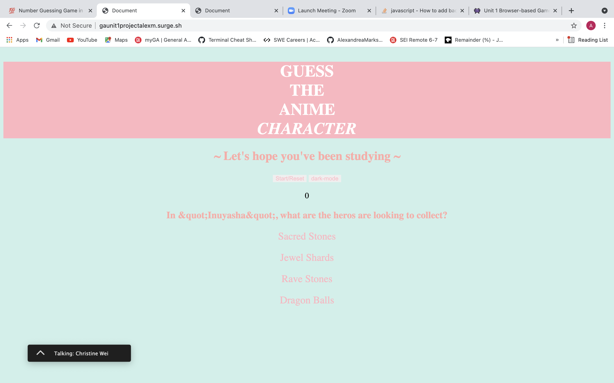
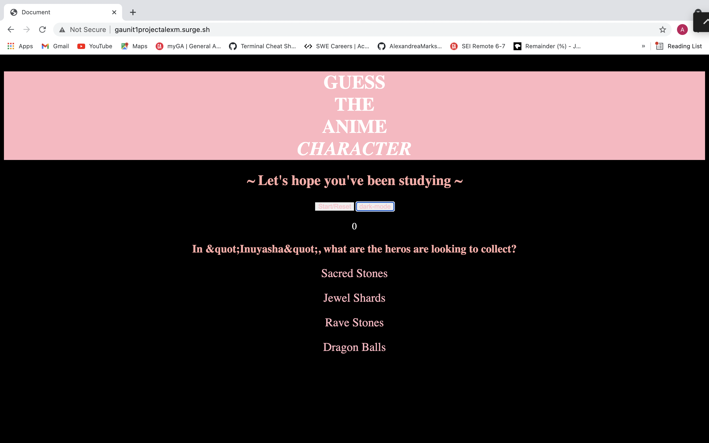

# Guess the Anime Character Quiz!

  ### [Play it Yourself!](http://gaunit1projectalexm.surge.sh/)

## This is a Quiz to test your knowledge of popular Anime

* Technologies Used: JavaScript, HTML, CSS, and API Trivia Open Database (https://opentdb.com/api_config.php).
* Images used: (https://www.google.com/url?sa=i&url=https%3A%2F%2Fsadistria.blogspot.com%2F2017%2F09%2Fcute-anime-girl-pink-hair-aesthetic.html&psig=AOvVaw2yj5GhnG88dFiDzEscHL_b&ust=1625253901973000&source=images&cd=vfe&ved=0CAoQjRxqFwoTCPi5nuHMwvECFQAAAAAdAAAAABAL)

### Rules: 
- Click on your answers and watch the score above!
  
- You gain 10 points for every answer you get right!

- There are 10 questions each round!

### There is a Light and Dark mode!

## Pseudo-code
*  As soon as the app loads, go request questions from Api
* Player presses start button, Quiz starts.
* "Show question" player picks answer if answer regradless of the correct answer, move on to the next question. 
* function called showQuestion with a parameter of the question it's showing. This function will show the number of the parameter
*  whenever they answer a question check to see if it's right or wrong and show next question.

* User/Question shows score and reset button. As soon as reset button is click on request more questions

* set up div structure for 1 question and 4 answers
* write function to show any question, given the parameter.
* more: get object from array that has the same index of the parameter give data from that object to the correct places in the data structure
* dataArray[parameterName] 
* when data Array reaches a certian lenght we need some logic to end the game// 
* data array has a question removed everytime the user answer a question; so this game is currently breaking when there are no questions left
